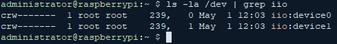
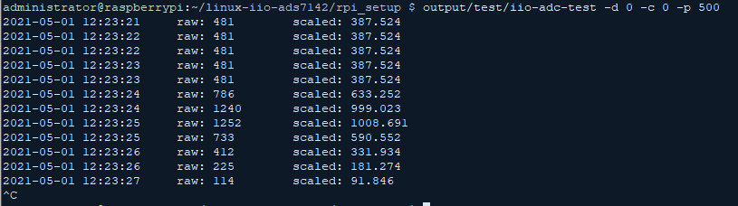

# linux-iio-ads7142

This is an iio driver for Texas Instruments ADS7142 dual-channel, programmable sensor monitor.

**Operation modes supported by the driver:**

When the 'ti,monitoring-mode' property is not present in the devicetree node definition, the driver initiates a single conversion in the device for each read request (/sys/bus/iio/devices/iio:deviceX/in_voltageY_raw). 
This is a one-shot conversion, and it is called
"Manual Mode" in the datasheet.

When the 'ti,monitoring-mode' property is present in the devicetree node definition, the driver configures the device's digital window comparator and sets the device's data buffer operation mode to pre alert data mode. The driver reads the conversion result when the BUSY/RDY interrupt fires, and keeps the value until the next BUSY/RDY interrupt or the first read request (/sys/bus/iio/devices/iio:deviceX/in_voltageY_raw). 
This is event driven conversion, and is called "Autonomous Mode with Pre Alert Data" in the datasheet. 
This mode can be used to wake up the system with the ALERT pin,
in case when the monitored voltage level is out of the configured range. 
The digital window comparator and hysteresis parameters can be controlled by:
  * the devicetree definition of channel node
  * iio sysfs interfaces

[0] - Datasheet: https://www.ti.com/lit/ds/symlink/ads7142.pdf

Additional readings:
* [1] - [sysfs-bus-iio](https://git.kernel.org/pub/scm/linux/kernel/git/torvalds/linux.git/tree/Documentation/ABI/testing/sysfs-bus-iio)

**Table of contents**

## 1. Building

### 1.1. Prerequirements

>sudo apt install git bc bison flex libssl-dev libncurses5-dev

### 1.2. Compile

>git clone https://github.com/dministro/linux-iio-ads7142 
cd linux-serial-ads7142/src/linux/drivers/iio/adc 
make -C `/path/to/kernel/source` M=$(pwd) modules

## 2. Interfaces

### 2.1. Device tree bindings

You can see the required parameters in [ti,ads7142.yaml](src/linux/Documentation/devicetree/bindings/iio/adc/ti,ads7142.yaml)

### 2.2. device

The driver instances are comes up under `/dev` as
>/dev/iio:device`X`

, where `X` is the index of instance.

### 2.3. sysfs
The ti-ads7142 driver uses configuration parameters and maintains conversion results inside sysfs filesystem.

More detailed descriptions about iio sysfs interfaces: [sysfs-bus-iio](https://git.kernel.org/pub/scm/linux/kernel/git/torvalds/linux.git/tree/Documentation/ABI/testing/sysfs-bus-iio)

**in_voltage`Y`_raw**

Path:
>/sys/bus/iio/devices/iio:device`X`/in_voltage`Y`_raw

Description:
>Shows raw conversion result, see ref: [1]

**in_voltage`Y`_sampling_frequency**

Path:
>/sys/bus/iio/devices/iio:device`X`/in_voltage`Y`_sampling_frequency

Description:
>Shows or stores the number of clocks in one conversion cycle, in combination with 'ti,osc-sel' binding parameter, the sampling speed can be calulated as described in the datasheet, see chapter 7.3.5 Oscillator and Timing Control in ref: [0]

**in_voltage`Y`_scale**

Path:
>/sys/bus/iio/devices/iio:device`X`/in_voltage`Y`_scale

Description:
>Shows the scale to calculate the mV value from raw conversion result, see ref: [1] 
Equation: mV = in_voltage`Y`_raw * in_voltage`Y`_scale. 
*Note:*
>>This attribute comes up, when the 'avdd-supply' property is present in the devicetree node definition.

**events/in_voltage`Y`_thresh_either_hysteresis**

Path:
>/sys/bus/iio/devices/iio:device`X`/events/in_voltage`Y`_thresh_either_hysteresis

Description:
>Shows or stores the hysteresis of threshold for channel `Y`, see chapter 7.3.9 Digital Window Comparator in ref: [0] 
*Note:*
>>This attribute comes up, when the 'ti,monitoring-mode' property is present in the devicetree node definition.

**events/in_voltage`Y`_thresh_falling_en**

Path:
>/sys/bus/iio/devices/iio:device`X`/events/in_voltage`Y`_thresh_falling_en

Description:
>Shows or stores the enable state of falling/low threshold event generation for channel `Y` 
*Note:*
>>This attribute comes up, when the 'ti,monitoring-mode' property is present in the devicetree node definition.

**events/in_voltage`Y`_thresh_falling_value**

Path:
>/sys/bus/iio/devices/iio:device`X`/events/in_voltage`Y`_thresh_falling_value

Description:
>Shows or stores the falling/low threshold level for channel `Y` 
*Note:*
>>This attribute comes up, when the 'ti,monitoring-mode' property is present in the devicetree node definition.

**events/in_voltage`Y`_thresh_rising_en**

Path:
>/sys/bus/iio/devices/iio:device`X`/events/in_voltage`Y`_thresh_rising_en

Description:
>Shows or stores the enable state of rising/high threshold event generation for channel `Y` 
*Note:*
>>This attribute comes up, when the 'ti,monitoring-mode' property is present in the devicetree node definition.

**events/in_voltage`Y`_thresh_rising_value**

Path:
>/sys/bus/iio/devices/iio:device`X`/events/in_voltage`Y`_thresh_rising_value

Description:
>Shows or stores the rising/high threshold level for channel `Y` 
*Note:*
>>This attribute comes up, when the 'ti,monitoring-mode' property is present in the devicetree node definition.

## 3. Sample setup with Raspberry Pi 3

Wiring:
|Raspberry Pi|Function           |Color |[DM.ADS7142.BOB](https://github.com/dministro/ads7142_breakout_board)|
|------------|-------------------|------|--------------|
|17          |3V3                |red   |1, 10         |
|3           |I2C1 SDA           |green |8             |
|5           |I2C1 SCL           |yellow|9             |
|25          |GND                |black |5             |
|36          |GPIO 16 *interrupt*|brown |4             |

### 3.1. Building

#### 3.1.1 Prerequirements

To compile si4455 kernel module on a Raspbian target the proper version of kernel source is required. 
See: https://github.com/RPi-Distro/rpi-source

>sudo apt install git bc bison flex libssl-dev libncurses5-dev

#### 3.1.1 Compile

For the setup above:

**Autonomous monitoring mode**
>cd rpi_setup 
OL_AVDD=vdd_3v3_reg \\ 
OL_BUS=1 \\ 
OL_ADDR=18 \\ 
OL_IRQ=16 \\ 
OL_MONITORING_MODE=y \\ 
OL_CH0_LTH=1000 \\ 
OL_CH0_HTH=3000 \\ 
OL_CH0_HYS=20 \\ 
OL_CH1_LTH=1000 \\ 
OL_CH1_HTH=3000 \\ 
OL_CH1_HYS=20 \\ 
make all

**Manual mode**
>cd rpi_setup 
OL_AVDD=vdd_3v3_reg \\ 
OL_BUS=1 \\ 
OL_ADDR=18 \\ 
make all

Parameters:
* **OL_BUS**: i2c bus index 
  default: 0
* **OL_ADDR**: device address (hexadecimal format) 
  default: 18
* **OL_IRQ**: interrupt gpio index 
  default: 16
* **OL_AVDD**: reference voltage regulator. 
  default: 
* **OL_MONITORING_MODE**: configures autonomous monitoring mode 
  default: 
* **OL_CH0_LTH**: low threshold of channel 0 
  default: 
* **OL_CH0_HTH**: high threshold of channel 0 
  default: 
* **OL_CH0_HYS**: hysteresis of channel 0 
  default: 
* **OL_CH1_LTH**: low threshold of channel 1 
  default: 
* **OL_CH1_HTH**: high threshold of channel 1 
  default: 
* **OL_CH1_HYS**: hysteresis of channel 1 
  default: 

Rules:
* *driver*: compiles the kernel module(ti-ads7142.ko)
* *driver-install*: *driver* rule plus copies the `ti-ads7142.ko` under `/lib/modules/$(uname -r)/extra`, then invokes `depmod`. 
  Requires: **root privilages**
* *overlay*: generates and compiles device tree bindings overlay. 
  Generated overlay name(under `output/overlay/build`): ads7142_i2c_\$(OL_BUS)_\$(OL_ADDR).dtbo
* *overlay-install*: *overlay* rule plus installs the overlay under `/boot/overlays`. 
  Requires: **root privilages**
* *boot-configure*: enables the i2c port and adds the overlay in `/boot/config.txt`. 
  Requires: **root privilages**
* *iio-adc-test*: compiles the iio-adc-test(`test/iio-adc-test`) then copy the compilation result to `rpi_setup/output/test/iio-adc-test`, then invokes `chmod +x` on it
* *install*: *driver-install* and *overlay-install* rules. 
  Requires: **root privilages**
* *all*: *install*, *boot-configure* and *iio-adc-test* rules. 
  Requires: **root privilages**

## 4. Testing

BOM:

* 1 × breadboard
* 1 × [Raspberry Pi 3 Model B](https://www.raspberrypi.org/products/raspberry-pi-3-model-b/)
* 2 × [ADS7142 breakout board (A003.0000017200_DM.ADS7142.BOB)](https://github.com/dministro/ads7142_breakout_board)
* some jumper wire to connectting parts
* voltage source for analog inputs (**important: maximum 3.3V**)

Wiring:
|Raspberry Pi|Function           |DM.ADS7142.BOB #0|DM.ADS7142.BOB #1|
|------------|-------------------|-----------------|-----------------|
|17          |3V3                |4                |4                |
|3           |I2C1 SDA           |8                |8                |
|5           |I2C1 SCL           |9                |9                |
|25          |GND                |5                |5                |
|36          |GPIO 16 *interrupt*|                 |4                |
|35          |GPIO 19 *interrupt*|4                |                 |

### 4.1. Manual mode

See chapter 7.4.2.2 Manual Mode with AUTO Sequence in ref[0].

#### 4.1.1. Compiling

For DM.ADS7142.BOB #0:
>cd rpi_setup 
OL_AVDD=vdd_3v3_reg OL_BUS=1 OL_ADDR=1f OL_IRQ=19 make all

For DM.ADS7142.BOB #1:
>cd rpi_setup 
OL_AVDD=vdd_3v3_reg OL_BUS=1 OL_ADDR=18 OL_IRQ=16 make all

#### 4.1.2. Testing
After compiling, restart is required to load overlays.

If probe success after boot, dmesg: 

The new devices are under `/dev`: 

If the new devices are visible under `/dev`, they are ready to use as an adc device. 

Testing with iio-adc-test:
>cd rpi_setup 
output/test/iio-adc-test -d 0 -c 0 -p 500

### 4.2. Autonomous mode with pre alert data

See chapter 7.4.3.1.1 Autonomous Mode with Pre Alert Data in ref[0].

#### 4.2.1. Compiling

For DM.ADS7142.BOB #0:
>cd rpi_setup 
OL_AVDD=vdd_3v3_reg \\ 
OL_BUS=1 \\ 
OL_ADDR=1f \\ 
OL_IRQ=19 \\ 
OL_MONITORING_MODE=y \\ 
OL_CH0_LTH=1000 \\ 
OL_CH0_HTH=3000 \\ 
OL_CH0_HYS=20 \\ 
OL_CH1_LTH=1000 \\ 
OL_CH1_HTH=3000 \\ 
OL_CH1_HYS=20 \\ 
make all

For DM.ADS7142.BOB #1:
>cd rpi_setup 
OL_AVDD=vdd_3v3_reg \\ 
OL_BUS=1 \\ 
OL_ADDR=18 \\ 
OL_IRQ=16 \\ 
OL_MONITORING_MODE=y \\ 
OL_CH0_LTH=1000 \\ 
OL_CH0_HTH=3000 \\ 
OL_CH0_HYS=20 \\ 
OL_CH1_LTH=1000 \\ 
OL_CH1_HTH=3000 \\ 
OL_CH1_HYS=20 \\ 
make all

#### 4.2.2. Testing
After compiling, restart is required to load overlays.

If probe success after boot, dmesg: 

The new devices are under `/dev`: 

If the new devices are visible under `/dev`, they are ready to use as an adc device. 

Testing with iio-adc-test:
>cd rpi_setup 
output/test/iio-adc-test -d 0 -c 0 -m --threshold-low 1000 --threshold-high 3000 --hysteresis 20

